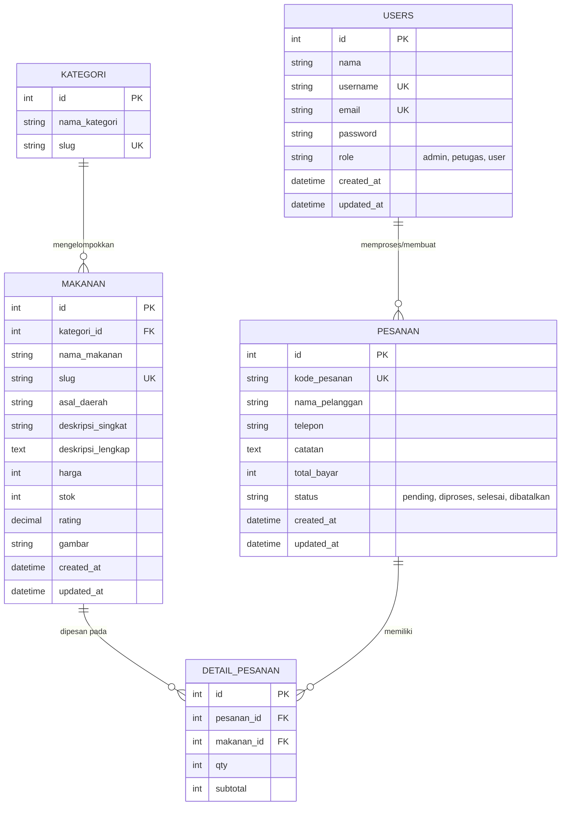
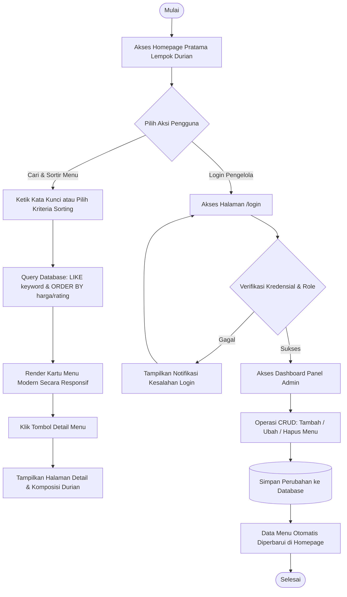
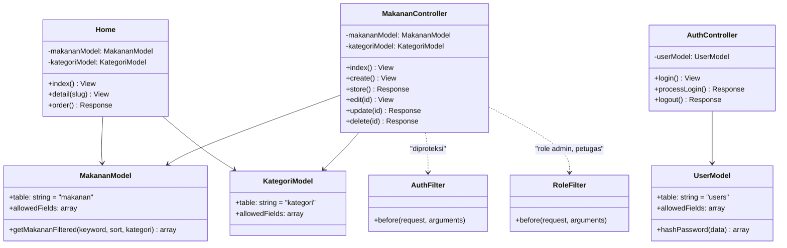

# Pratama — Lempok Durian Khas Bengkulu

Aplikasi web promosi kuliner modern untuk mengangkat makanan khas daerah Bengkulu (Lempok Durian) ke level industri modern, terinspirasi dari estetika antarmuka rantai restoran cepat saji kontemporer (seperti KFC, Burger Bangor, Pizza Hut, dan Five Guys).

Proyek ini disusun untuk memenuhi tugas **Ujian Praktik On The Spot Coding Pemrograman Framework (CodeIgniter 4 + Tailwind CSS + MySQL)**.

---

## 1. Profil Proyek & Ketentuan Tugas

- **Nama Siswa**: Fabian Rizky Pratama
- **Brand Restoran**: Pratama Lempok Durian (Diambil dari nama belakang siswa)
- **Provinsi & Makanan Khas**: Bengkulu — Lempok Durian
- **Skema Warna Resmi**:
  - **Warna Utama (Dominan)**: `#3730A3` (Indigo 800 — Navbar, Hero, Tombol Utama, Badge Tegas)
  - **Warna Aksen (Pendukung)**: `#FDBA74` (Warm Durian Peach — Hover, Border Aksen, Highlight Bintang Rating)
- **Fitur Khusus Wajib**:
  1. **Pencarian (Search)**: Pencarian cepat berdasarkan nama makanan, bahan, dan deskripsi rasa.
  2. **Pengurutan (Sorting)**: Filter urutan termurah, termahal, rating tertinggi, dan nama A-Z.
- **Katalog Menu**: 8+ variasi olahan Lempok Durian asli Bengkulu.
- **Teknologi**: PHP 8.5, CodeIgniter 4 (v4.7.4), Tailwind CSS via CDN, Alpine.js, MariaDB/MySQL.

---

## 2. Rencana Tahapan Pengerjaan & Commit Git

Pengerjaan dibagi ke dalam 4 tahapan dengan pesan commit resmi:

| Tahap | Alokasi Waktu | Pesan Commit Resmi | Output Utama |
|---|:---:|---|---|
| **Tahap 1** | Menit 00–15 | `Setup database & migration Lempok Durian` | PRD arsitektur, migrasi tabel (`users`, `kategori`, `makanan`, `pesanan`), model, dan seeder 8+ menu |
| **Tahap 2** | Menit 15–30 | `CRUD dasar + tampilan Tailwind Lempok Durian` | Autentikasi multi-role, dashboard admin panel, CRUD data master makanan dengan Tailwind CDN |
| **Tahap 3** | Menit 30–45 | `Halaman detail + fitur tambahan + gambar AI Lempok Durian` | Homepage modern restoran, halaman detail menu, implementasi fitur search & sorting, gambar visual |
| **Tahap 4** | Menit 45–60 | `Finalisasi Lempok Durian` | Notifikasi interaktif, pengujian multi-akun, push ke GitHub `https://github.com/SukaMCD/PTS.git` & submit form |

---

## 3. Matriks Hak Akses Pengguna (Multi-Role)

Sistem menerapkan pembagian hak akses 3 tingkat yang diproteksi melalui `RoleFilter`:

| Fitur / Halaman | Administrator | Petugas / Staff | Pelanggan / User |
|---|:---:|:---:|:---:|
| Akses Homepage Restoran Modern | Ya | Ya | Ya |
| Filter Kategori, Pencarian, & Sorting | Ya | Ya | Ya |
| Halaman Detail & Ulasan Makanan | Ya | Ya | Ya |
| Form Pemesanan Cepat (Fast Order) | Ya | Ya | Ya |
| Manajemen Menu Makanan (CRUD Penuh) | Ya | Ya | Tidak |
| Manajemen Kategori & Stok Produk | Ya | Ya | Tidak |
| Kelola Akun & Hak Akses Pengguna | Ya | Tidak | Tidak |
| Dashboard Ringkasan Metrik Produk | Ya | Ya | Tidak |

---

## 4. Entity Relationship Diagram (ERD)

Struktur tabel dan relasi foreign key pada database `db_pts`:



---

## 5. Alur Proses Bisnis (Flowchart)

Diagram alir transaksi, pencarian, dan pengelolaan menu:



---

## 6. Arsitektur Kelas MVC

Pemetaan controller, model, dan filter otorisasi pada CodeIgniter 4:



---

## 7. Rincian 8 Variasi Menu Makanan (Katalog Pratama)

1. **Lempok Durian Original Bengkulu**: Olahan tradisional murni 100% daging durian asli dengan tekstur kenyal legit. (Rp 45.000)
2. **Lempok Durian Super Tembaga Premium**: Dibuat eksklusif dari durian tembaga pilihan Bengkulu beraroma harum semerbak. (Rp 65.000)
3. **Lempok Durian Panggang Wijen**: Sensasi lempok manis gurih bertabur wijen sangrai renyah. (Rp 48.000)
4. **Lempok Durian Daun Pandan Wangi**: Perpaduan sari pandan asli dan legit durian khas pesisir barat Sumatera. (Rp 50.000)
5. **Lempok Durian Mini Snack Pack**: Kemasan travel praktis isi 10 potong bite-sized siap santap. (Rp 35.000)
6. **Dodol Lempok Gula Aren Curup**: Sentuhan rasa karamel dari gula aren murni Bukit Kaba Rejang Lebong. (Rp 52.000)
7. **Pratama Royal Durian Gift Box**: Paket hampers oleh-oleh eksklusif dengan kotak hardbox premium. (Rp 120.000)
8. **Pancake Lempok Durian Lumer**: Inovasi dessert modern, lapisan crepe tipis dengan isian pasta lempok durian legit. (Rp 38.000)
9. **Lempok Durian Crispy Pastry Roll**: Pastry renyah dengan isian lempok durian hangat meleleh. (Rp 32.000)

---

## 8. Petunjuk Instalasi & Pengujian

### 1. Migrasi Database & Pengisian Data Awal
```bash
php spark migrate
php spark db:seed UserSeeder
php spark db:seed MakananSeeder
```

### 2. Menjalankan Server Lokal
```bash
php spark serve
```
Aplikasi dapat diakses melalui peramban pada alamat: `http://localhost:8080`

### 3. Akun Pengujian Bawaan (Default Seeder)
| Peran (Role) | Username | Password | Hak Akses |
|---|---|---|---|
| Administrator | `admin` | `admin123` | Akses penuh dashboard, manajemen menu makanan (CRUD), dan sistem |
| Petugas / Staff | `petugas` | `petugas123` | Akses operasional katalog makanan (CRUD menu makanan) |
| Pelanggan / User | `user` | `user123` | Akses pemesanan dan eksplorasi menu di halaman publik |
